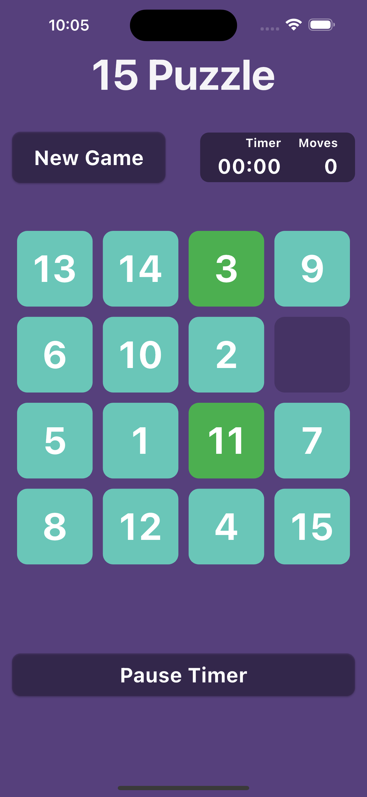

# Flutter Tile Game (15 Puzzle)

A simple and interactive 15 Puzzle game built with Flutter. The objective of the game is to arrange the tiles in numerical order by sliding them into the empty space.

## Table of Contents

- [Flutter Tile Game (15 Puzzle)](#flutter-tile-game-15-puzzle)
  - [Table of Contents](#table-of-contents)
  - [Features](#features)
  - [Installation](#installation)
  - [Usage](#usage)
  - [Game Controls](#game-controls)
  - [Screenshots](#screenshots)
  - [Contributing](#contributing)
  - [License](#license)

## Features

- Interactive tile movement
- Timer to track elapsed time
- Move counter to track the number of moves
- Shuffle tiles with solvable configurations
- Responsive design for various screen sizes

## Installation

To run this project, you need to have Flutter installed on your machine. Follow these steps to set up the project:

1. Clone the repository:
   ```bash
   git clone https://github.com/yourusername/flutter-tile-game.git
   cd flutter-tile-game
   ```

2. Install the dependencies:
   ```bash
   flutter pub get
   ```

3. Run the application:
   ```bash
   flutter run
   ```

## Usage

Once the application is running, you can start playing the game by tapping on the tiles adjacent to the empty space. The timer will start when you make your first move, and you can pause the timer at any time.

## Game Controls

- **New Game**: Resets the game and reshuffles the tiles.
- **Pause Timer**: Pauses the timer during gameplay.

## Screenshots

Here are some screenshots of the game in action:



## Contributing

Contributions are welcome! If you have suggestions for improvements or new features, please fork the repository and submit a pull request.

1. Fork the repository.
2. Create a new branch (`git checkout -b feature/YourFeature`).
3. Make your changes and commit them (`git commit -m 'Add some feature'`).
4. Push to the branch (`git push origin feature/YourFeature`).
5. Open a pull request.

## License

This project is licensed under the MIT License - see the [LICENSE](LICENSE) file for details.
